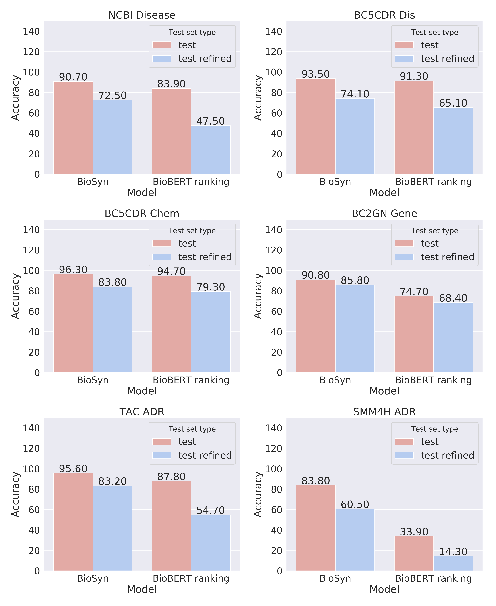

Fair Evaluation in Concept Normalization: a Large-scale Comparative Analysis for BERT-based Models
---

<p style="text-align: center;">
Overview: This repository contains additional materials of the paper "Fair Evaluation in Concept Normalization: a Large-scale ComparativeAnalysis for BERT-based Models"
</p>

## Results

##### Table 1

This table presents the summary statistics of corpora used in study. 

<table>
<thead>
<tr class="header">
<th style="text-align: left;"></th>
<th style="text-align: left;"><strong>NCBI Disease</strong></th>
<th style="text-align: left;"><strong>BC5CDR Disease</strong></th>
<th style="text-align: left;"><strong>BC5CDR Chem</strong></th>
<th style="text-align: left;"><strong>BC2GN Gene</strong></th>
<th style="text-align: left;"><strong>TAC 2017 ADR</strong></th>
<th style="text-align: left;"><strong>SMM4H 2017 ADR</strong></th>
</tr>
</thead>
<tbody>
<tr class="odd">
<td style="text-align: left;">domain</td>
<td style="text-align: left;">abstracts</td>
<td style="text-align: left;">abstracts</td>
<td style="text-align: left;">abstracts</td>
<td style="text-align: left;">abstracts</td>
<td style="text-align: left;">drug labels</td>
<td style="text-align: left;">tweets</td>
</tr>
<tr class="even">
<td style="text-align: left;">entity type</td>
<td style="text-align: left;">disease</td>
<td style="text-align: left;">disease</td>
<td style="text-align: left;">chemicals</td>
<td style="text-align: left;">genes</td>
<td style="text-align: left;">ADRs</td>
<td style="text-align: left;">ADRs</td>
</tr>
<tr class="odd">
<td style="text-align: left;">terminology</td>
<td style="text-align: left;">MEDIC</td>
<td style="text-align: left;">MEDIC</td>
<td style="text-align: left;">CTD Chem</td>
<td style="text-align: left;">Entrez Gene</td>
<td style="text-align: left;">MedDRA</td>
<td style="text-align: left;">MedDRA</td>
</tr>
<tr class="even">
<td style="text-align: center;" colspan="7">number of pre-processed entity mentions</td>
</tr>
<tr class="odd">
<td style="text-align: left;">full corpus</td>
<td style="text-align: left;">6881</td>
<td style="text-align: left;">12850</td>
<td style="text-align: left;">15935</td>
<td style="text-align: left;">5712</td>
<td style="text-align: left;">13381</td>
<td style="text-align: left;">9150</td>
</tr>
<tr class="even">
<td style="text-align: left;">avg. len in chars</td>
<td style="text-align: left;">20.37</td>
<td style="text-align: left;">14.88</td>
<td style="text-align: left;">11.27</td>
<td style="text-align: left;">8.35</td>
<td style="text-align: left;">17.28</td>
<td style="text-align: left;">11.69</td>
</tr>
<tr class="odd">
<td style="text-align: left;">% have numerals</td>
<td style="text-align: left;">5.74%</td>
<td style="text-align: left;">0.11%</td>
<td style="text-align: left;">7.32%</td>
<td style="text-align: left;">62.46%</td>
<td style="text-align: left;">1.62%</td>
<td style="text-align: left;">2.52%</td>
</tr>
<tr class="even">
<td style="text-align: left;">train set</td>
<td style="text-align: left;">5134</td>
<td style="text-align: left;">4182</td>
<td style="text-align: left;">5203</td>
<td style="text-align: left;">2725</td>
<td style="text-align: left;">7038</td>
<td style="text-align: left;">6650</td>
</tr>
<tr class="odd">
<td style="text-align: left;">dev set</td>
<td style="text-align: left;">787</td>
<td style="text-align: left;">4244</td>
<td style="text-align: left;">5347</td>
<td style="text-align: left;">-</td>
<td style="text-align: left;">-</td>
<td style="text-align: left;">-</td>
</tr>
<tr class="even">
<td style="text-align: left;">test set</td>
<td style="text-align: left;">960</td>
<td style="text-align: left;">4424</td>
<td style="text-align: left;">5385</td>
<td style="text-align: left;">2987</td>
<td style="text-align: left;">6343</td>
<td style="text-align: left;">2500</td>
</tr>
<tr class="odd">
<td style="text-align: left;"><em>refined</em> test</td>
<td style="text-align: left;">204 (21.2%)</td>
<td style="text-align: left;">657 (14.9%)</td>
<td style="text-align: left;">425 (7.9%)</td>
<td style="text-align: left;">985 (32.9%)</td>
<td style="text-align: left;">1,544 (24.3%)</td>
<td style="text-align: left;">831 (33.3%)</td>
</tr>
<tr class="even">
<td style="text-align: center;" colspan="7">number of concepts</td>
</tr>
<tr class="odd">
<td style="text-align: left;">train set <span class="math inline">|T_1|</span></td>
<td style="text-align: left;">668</td>
<td style="text-align: left;">968</td>
<td style="text-align: left;">922</td>
<td style="text-align: left;">556</td>
<td style="text-align: left;">1517</td>
<td style="text-align: left;">472</td>
</tr>
<tr class="even">
<td style="text-align: left;">test set <span class="math inline">|T_2|</span></td>
<td style="text-align: left;">203</td>
<td style="text-align: left;">669</td>
<td style="text-align: left;">617</td>
<td style="text-align: left;">670</td>
<td style="text-align: left;">1323</td>
<td style="text-align: left;">254</td>
</tr>
<tr class="odd">
<td style="text-align: left;"><em>refined</em> test <span class="math inline">|T_3|</span></td>
<td style="text-align: left;">140</td>
<td style="text-align: left;">438</td>
<td style="text-align: left;">351</td>
<td style="text-align: left;">642</td>
<td style="text-align: left;">857</td>
<td style="text-align: left;">201</td>
</tr>
<tr class="even">
<td style="text-align: left;"><span class="math inline">|T_1 & T_2|</span></td>
<td style="text-align: left;">136</td>
<td style="text-align: left;">457</td>
<td style="text-align: left;">368</td>
<td style="text-align: left;">55</td>
<td style="text-align: left;">867</td>
<td style="text-align: left;">218</td>
</tr>
<tr class="odd">
<td style="text-align: left;"><span class="math inline">|T_1 & T_3|</span></td>
<td style="text-align: left;">76</td>
<td style="text-align: left;">226</td>
<td style="text-align: left;">102</td>
<td style="text-align: left;">27</td>
<td style="text-align: left;">401</td>
<td style="text-align: left;">165</td>
</tr>
</tbody>
</table>

##### Plot 1

This plot shows differences in evaluation metrics on the refined and full test set of BioSyn and BERT ranking approaches.




##### Table 2

Tables 2 and 3 contain metrics on cross-terminology evaluation mode. Table 3 contains accuracies, Table 4 differences 
between in-corpus trained and cross-corpus trained models

<table>
<tbody>
<tr class="odd">
<td style="text-align: left;" rowspan="2"><strong>Test set</strong></td>
<td style="text-align: center;" colspan="6"><strong>Train set</strong></td>
</tr>
<tr class="even">
<td style="text-align: center;">NCBI Dis</td>
<td style="text-align: center;">BC5CDR Dis</td>
<td style="text-align: center;">BC5CDR Chem</td>
<td style="text-align: center;">BC2GN Gene</td>
<td style="text-align: center;">TAC ADR</td>
<td style="text-align: center;">SMM4H ADR</td>
</tr>
<tr class="odd">
<td style="text-align: left;">NCBI</td>
<td style="text-align: center;"><strong>72.5</strong></td>
<td style="text-align: center;">67.6</td>
<td style="text-align: center;">64.7</td>
<td style="text-align: center;">67.6</td>
<td style="text-align: center;">67.2</td>
<td style="text-align: center;">48.5</td>
</tr>
<tr class="even">
<td style="text-align: left;">CDR Dis</td>
<td style="text-align: center;">74.7</td>
<td style="text-align: center;">74.1</td>
<td style="text-align: center;">73.4</td>
<td style="text-align: center;"><strong>74.9</strong></td>
<td style="text-align: center;">73.1</td>
<td style="text-align: center;">58.3</td>
</tr>
<tr class="odd">
<td style="text-align: left;">CDR Chem</td>
<td style="text-align: center;">82.4</td>
<td style="text-align: center;"><strong>84.2</strong></td>
<td style="text-align: center;">83.8</td>
<td style="text-align: center;">82.4</td>
<td style="text-align: center;">82.6</td>
<td style="text-align: center;">73.9</td>
</tr>
<tr class="even">
<td style="text-align: left;">TAC ADR</td>
<td style="text-align: center;">74.3</td>
<td style="text-align: center;">77.5</td>
<td style="text-align: center;">70.1</td>
<td style="text-align: center;"><strong>83.2</strong></td>
<td style="text-align: center;">69.9</td>
<td style="text-align: center;">51.5</td>
</tr>
<tr class="odd">
<td style="text-align: left;">BC2GN</td>
<td style="text-align: center;">83.1</td>
<td style="text-align: center;">81.7</td>
<td style="text-align: center;">83.7</td>
<td style="text-align: center;">82.6</td>
<td style="text-align: center;"><strong>85.8</strong></td>
<td style="text-align: center;">73.2</td>
</tr>
<tr class="even">
<td style="text-align: left;">SMM4H ADR</td>
<td style="text-align: center;">27.3</td>
<td style="text-align: center;">35.6</td>
<td style="text-align: center;">24.8</td>
<td style="text-align: center;">30.1</td>
<td style="text-align: center;">21.9</td>
<td style="text-align: center;"><strong>60.5</strong></td>
</tr>
</tbody>
</table>

##### Table 3 

<table>
<tbody>
<tr class="odd">
<td style="text-align: left;" rowspan="2"><strong>Test set</strong></td>
<td style="text-align: center;" colspan="6"><strong>Train set</strong></td>
</tr>
<tr class="even">
<td style="text-align: center;">NCBI Dis</td>
<td style="text-align: center;">BC5CDR Dis</td>
<td style="text-align: center;">BC5CDR Chem</td>
<td style="text-align: center;">BC2GN Gene</td>
<td style="text-align: center;">TAC ADR</td>
<td style="text-align: center;">SMM4H ADR</td>
</tr>
<tr class="odd">
<td style="text-align: left;">NCBI Disease</td>
<td style="text-align: center;">72.5</td>
<td style="text-align: center;">-4.9</td>
<td style="text-align: center;">-7.8</td>
<td style="text-align: center;">-5.4</td>
<td style="text-align: center;">-4.9</td>
<td style="text-align: center;">-24.0</td>
</tr>
<tr class="even">
<td style="text-align: left;">BC5CDR Dis</td>
<td style="text-align: center;">+0.6</td>
<td style="text-align: center;">74.1</td>
<td style="text-align: center;">-0.8</td>
<td style="text-align: center;">-1.1</td>
<td style="text-align: center;">+0.8</td>
<td style="text-align: center;">-15.8</td>
</tr>
<tr class="odd">
<td style="text-align: left;">BC5CDR Chem</td>
<td style="text-align: center;">-1.4</td>
<td style="text-align: center;">+0.5</td>
<td style="text-align: center;">83.8</td>
<td style="text-align: center;">-1.2</td>
<td style="text-align: center;">-1.4</td>
<td style="text-align: center;">-9.9</td>
</tr>
<tr class="even">
<td style="text-align: left;">BC2GN Gene</td>
<td style="text-align: center;">-2.6</td>
<td style="text-align: center;">-4.1</td>
<td style="text-align: center;">-2.1</td>
<td style="text-align: center;">85.8</td>
<td style="text-align: center;">-3.1</td>
<td style="text-align: center;">-12.6</td>
</tr>
<tr class="odd">
<td style="text-align: left;">TAC ADR</td>
<td style="text-align: center;">-8.9</td>
<td style="text-align: center;">-5.7</td>
<td style="text-align: center;">-13.0</td>
<td style="text-align: center;">-13.3</td>
<td style="text-align: center;">83.2</td>
<td style="text-align: center;">-31.7</td>
</tr>
<tr class="even">
<td style="text-align: left;">SMM4H ADR</td>
<td style="text-align: center;">-33.2</td>
<td style="text-align: center;">-24.9</td>
<td style="text-align: center;">-35.7</td>
<td style="text-align: center;">-38.6</td>
<td style="text-align: center;">-30.4</td>
<td style="text-align: center;">60.5</td>
</tr>
</tbody>
</table>

### Conclusion
We have presented the first comparative evaluation of medical concept normalization (MCN) datasets, studying the NCBI Disease, 
BC5CDR Disease & Chemical, BC2GN Gene, TAC 2017 ADR, and SMM4H 2017 ADR corpora. We perform an extensive evaluation of two 
BERT-based models on six datasets in two setups: with official train/test splits and with the proposed test sets that represent 
refined samples of entity mentions. Our evaluation shows great divergence in performance between these two test sets, 
finding an average accuracy difference of 15% for the state-of-the-art model BioSyn. We also performed a quantitative evaluation of 
BioSyn in the cross-terminology MCN task where models were trained and evaluated on entity mentions of various types with concepts 
from different terminologies. Knowledge transfer can be effective between diseases, chemicals, and genes with an average drop of 
2.53% accuracy in the performance on NCBI, BC5CDR, and BC2GN sets. For TAC and SMM4H sets with ADRs from drug labels and social 
media, BioSyn models trained on four other corpora show a substantial decrease in performance (-10.2% and -33.1% accuracy, 
respectively) compared to in-domain trained models.
To our surprise, these models still outperformed the straightforward ranking baseline on BioBERT representations. We believe 
that refined datasets with cross-terminology evaluation can serve as a step toward reliable and large-scale evaluation 
of biomedical IE models.

## Requirements
```bash
$ pip install -r requirements.txt
```

## Resources

### Pretrained Model
We use the [Huggingface](https://github.com/huggingface/transformers) version of [BioBERT v1.1](https://github.com/dmis-lab/biobert) so that the pretrained model can be run on the pytorch framework.

- [biobert v1.1 (pytorch)](https://drive.google.com/drive/folders/1nSjj-ubecQbwYPdz3NyAqiJ1-rLtguUp?usp=sharing)

### Datasets

Datasets and the preprocessing procedures are used the same as in [BioSyn](https://github.com/dmis-lab/BioSyn). Additionally, we used SMM4H 2017 dataset.
We made available all [datasets](https://yadi.sk/d/lQ8bAhFMnjSvTA) except TAC ADR 2017. TAC2017ADR dataset cannot be shared because of the license issue.
But we made available preprocessing scripts.


## Preprocess

To get a refined test set from the test set simply run:

```bash
$ python process_data.py --train_data_folder /data/ncbi/processed_train \
                         --test_data_folder /data/ncbi/processed_test \
                         --save_to /data/ncbi/processed_test_refined

```

## Train

To train the BioSyn models follow the [instructions](https://github.com/dmis-lab/BioSyn). BERT ranking doesn't require any training procedure.
## Evaluation

To eval BioSyn trained models follow the [instructions](https://github.com/dmis-lab/BioSyn). 
To eval the BERT ranking run the command:

```bash
$ python process_data.py --model_dir /data/pretrained_models/biobert_v1.1_pubmed_pytorch/ \
                         --data_folder /data/ncbi/processed_test \
                         --vocab /data/ncbi/test_dictionary.txt

```

## Citing & Authors
Tutubalina E., Kadurin A., Miftahutdinov Z. Fair Evaluation in Concept Normalization: a Large-scale Comparative Analysis for BERT-based Models 
//Proceedings of the 28th International Conference on Computational Linguistics. – 2020. – С. 6710-6716.[link](https://www.aclweb.org/anthology/2020.coling-main.588/)

BibTex

```
@inproceedings{tutubalina-etal-2020-fair,
    title = "Fair Evaluation in Concept Normalization: a Large-scale Comparative Analysis for {BERT}-based Models",
    author = "Tutubalina, Elena  and
      Kadurin, Artur  and
      Miftahutdinov, Zulfat",
    booktitle = "Proceedings of the 28th International Conference on Computational Linguistics",
    month = dec,
    year = "2020",
    address = "Barcelona, Spain (Online)",
    publisher = "International Committee on Computational Linguistics",
    url = "https://www.aclweb.org/anthology/2020.coling-main.588",
    pages = "6710--6716",
 }
```
